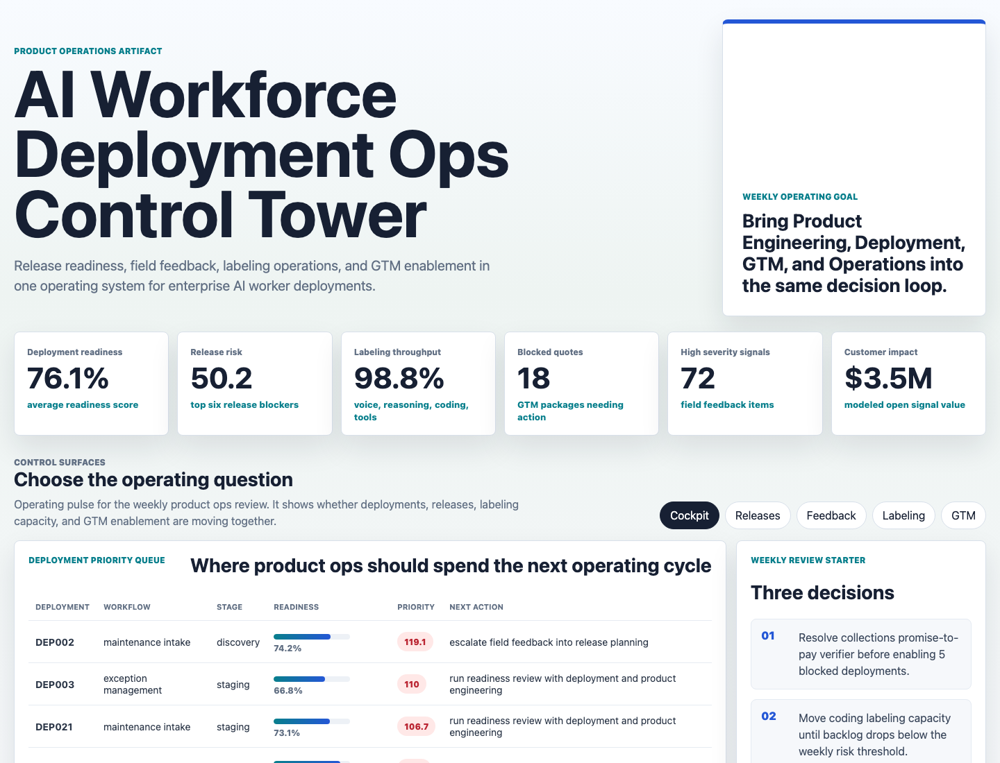
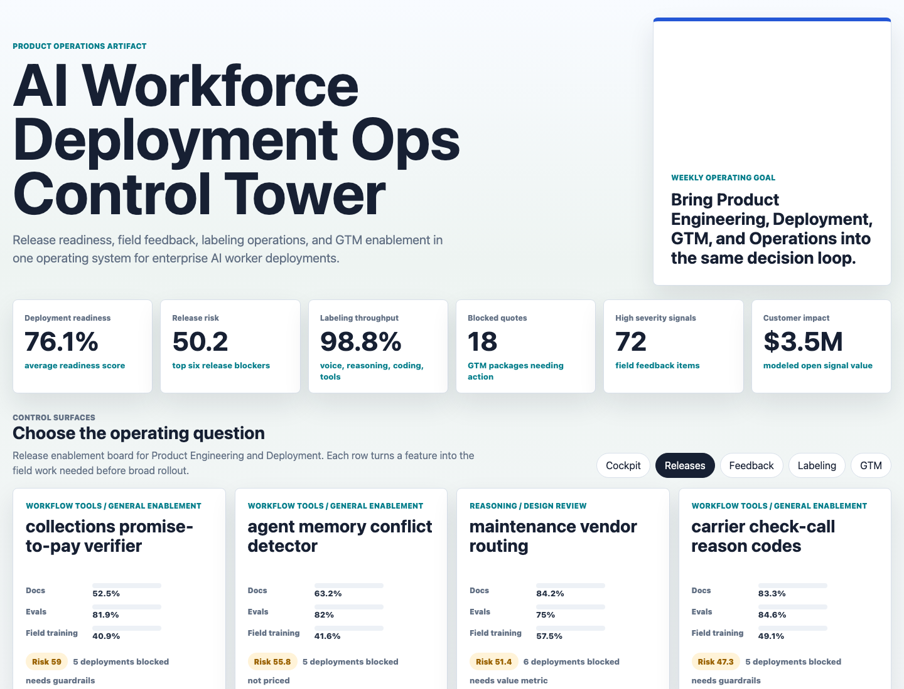
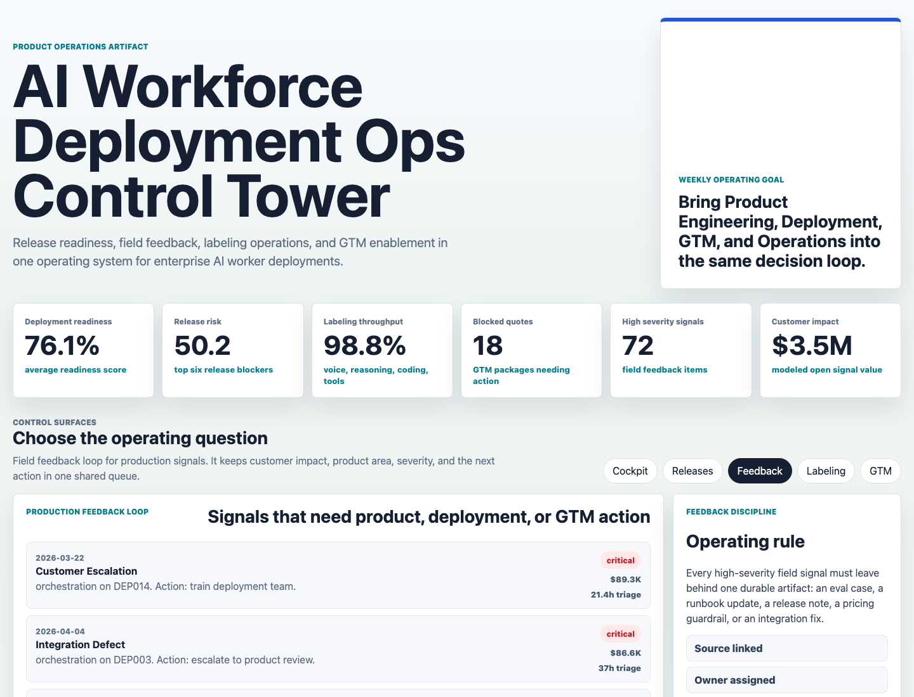
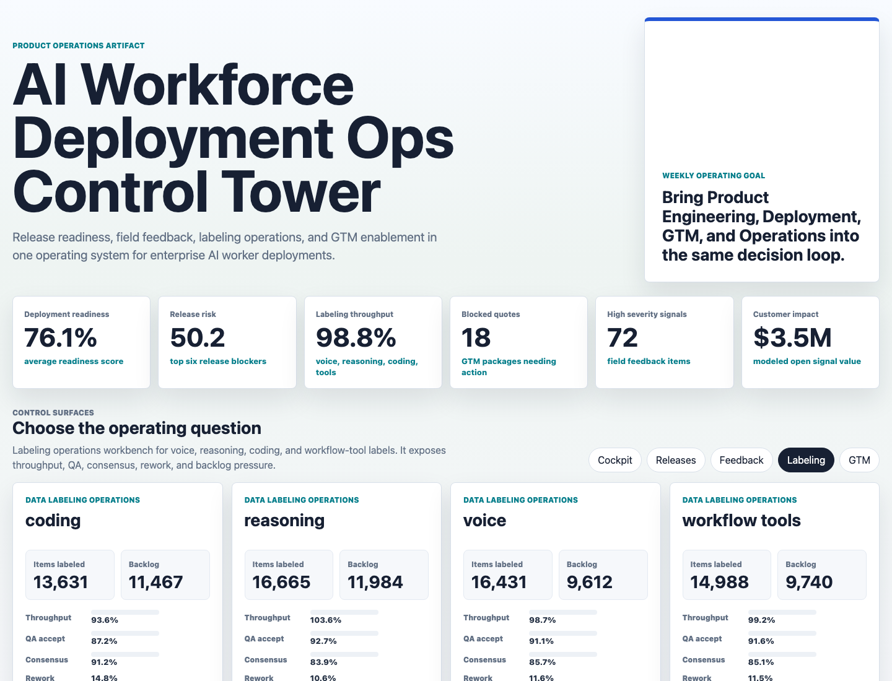
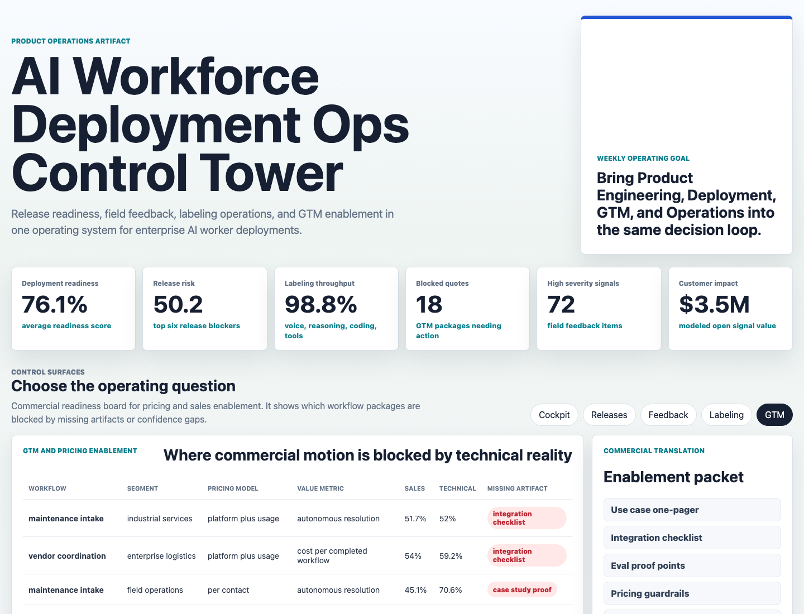

# AI Workforce Deployment Ops Control Tower

This portfolio artifact models the operating system a Product Operations Engineer would use at an enterprise AI workforce platform. It connects product releases, deployment readiness, field feedback, labeling operations, and GTM enablement so Product Engineering, Deployment, GTM, and Operations can make the same weekly decisions from the same evidence.

The project is intentionally more than a dashboard. It includes synthetic source data, a reproducible scoring pipeline, analysis outputs, SQL-style operating checks, and a multi-surface web console.

## What It Shows

- Which AI worker deployments need immediate product ops attention.
- Which product releases are blocked by docs, evals, field training, or pricing gaps.
- Which field feedback signals should become eval cases, runbook updates, release notes, pricing guardrails, or integration fixes.
- Which labeling operations need more capacity or quality review across voice, reasoning, coding, and workflow-tool labels.
- Which GTM packages are blocked by missing commercial or technical enablement artifacts.

## Screenshots



The cockpit starts the weekly operating review with deployment readiness, release risk, labeling throughput, blocked quotes, field severity, customer impact, and the top priority queue.



The release readiness board converts shipped features into enablement work by showing documentation, eval performance, field training, deployment blockers, and pricing status.



The field feedback loop turns production signals into product actions with severity, estimated customer impact, triage time, linked deployment, product area, and next action.



The labeling workbench tracks human labeling throughput, QA acceptance, consensus, rework, backlog, and risk by AI worker capability.



The GTM board highlights where pricing and sales motions are blocked by technical confidence gaps or missing enablement artifacts.

## Data

All data is synthetic and generated by `scripts/score_operating_data.py` with a fixed random seed. It does not represent real company performance, real customers, or real deployments.

The generator models a realistic operating structure for enterprise AI worker deployments:

- Deployment records across logistics-style and industrial operations workflows, including appointment scheduling, delivery tracking, exception management, vendor coordination, maintenance intake, and collections follow-up.
- Release readiness records with documentation readiness, eval pass rate, field training status, blocked deployments, GTM motion, and pricing or packaging status.
- Field feedback records from field calls, QA review, sales enablement, customer ops reviews, and escalation channels.
- Labeling batches across voice, reasoning, coding, and workflow-tool capabilities, with throughput, QA acceptance, consensus, rework, and backlog.
- GTM enablement records with pricing model, value metric, sales confidence, technical confidence, missing artifacts, and quote blockers.

Source tables live in `data/`. Derived outputs live in `analysis/outputs/`.

## Analysis Outputs

- `analysis/outputs/deployment_priority_queue.csv`
- `analysis/outputs/release_enablement_queue.csv`
- `analysis/outputs/labeling_ops_summary.csv`
- `analysis/outputs/gtm_readiness_queue.csv`
- `analysis/executive_findings.md`
- `analysis/analysis_plan.md`
- `analysis/methodology.md`
- `analysis/sql_checks.sql`

## Role Relevance

This artifact demonstrates the exact mix of work expected from a product operations engineer in enterprise AI workforce deployment:

- Bridge Product Engineering and Deployment with release readiness and field blocker tracking.
- Translate technical reality into GTM enablement and pricing readiness.
- Own metrics and measurement by turning raw operating data into prioritized queues.
- Manage the human side of the agentic stack through labeling throughput and QA monitoring.
- Create repeatable operating cadence instead of one-off analysis.

## Scope

This is a static portfolio artifact with deterministic synthetic data and transparent rules-based scoring. It does not connect to live enterprise systems, call real APIs, automate real labeling vendors, or represent actual company/customer data.

## Run Locally

```bash
npm run analyze
npm start
```

Then open `http://127.0.0.1:4173`.
